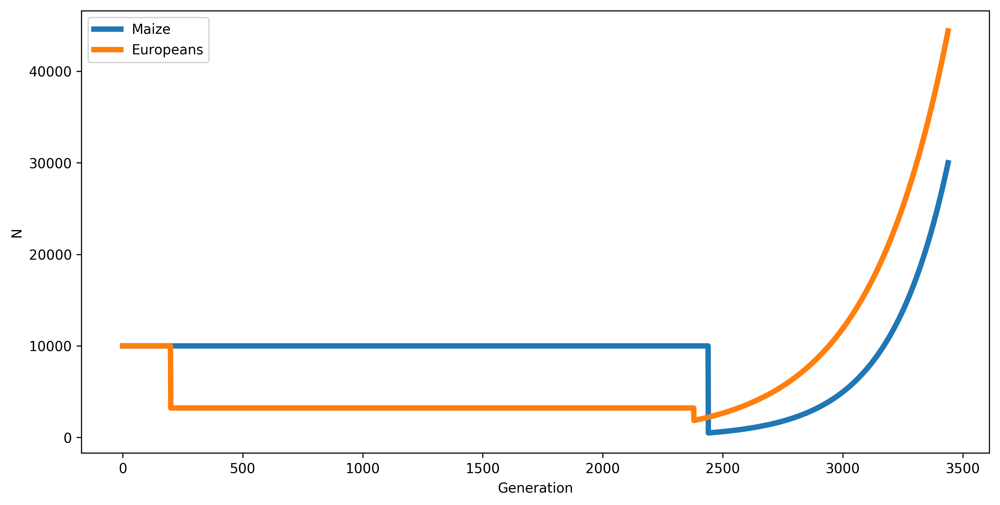

# Background selection Simulations

Simulated data from $N_e=10,000$ with bottleneck and growth following [Beissinger et al. 2016](https://www.nature.com/articles/nplants201684). Munged data will be neutral $\pi$ and $\xi_1$ (singletons) shown every 100 generations in each of 24 4Kb windows centered around a 4kb "gene" which has neutral (\frac{1}{4}) and deleterious (\frac{3}{4}) mutations. Deleterious mutations are drawn from a gamma with some mean s (see below).

For Europeans, we follow a slightly modified model of [Torres et al. 2017](http://www.biorxiv.org/content/early/2017/09/01/181859) but the gene model is as above. 

Our demographic model is 

# Simulations

An example simulation as ipython notebook can be found in [sims/Example\_sim.ipynb](sims/Example_sim.ipynb)

to run sims from the command line use

	python sim_maize_europeans_deleterious.py [RUN ID (INTEGER)]
	python sim_maize_europeans_neutral.py [RUN ID (INTEGER)]
	
or start an array of runs on farm with

	sbatch -p bigmemm start_pop_sim_deleterious.sh
	sbatch -p bigmemm start_pop_sim_neutral.sh
	
	
# Analysis

The analysis scrip is [analysis/BGS\_sim\_analysis.Rmd](analysis/BGS_sim_analysis.Rmd)

Results in html format are available [here](analysis/BGS_sim_analysis.html)